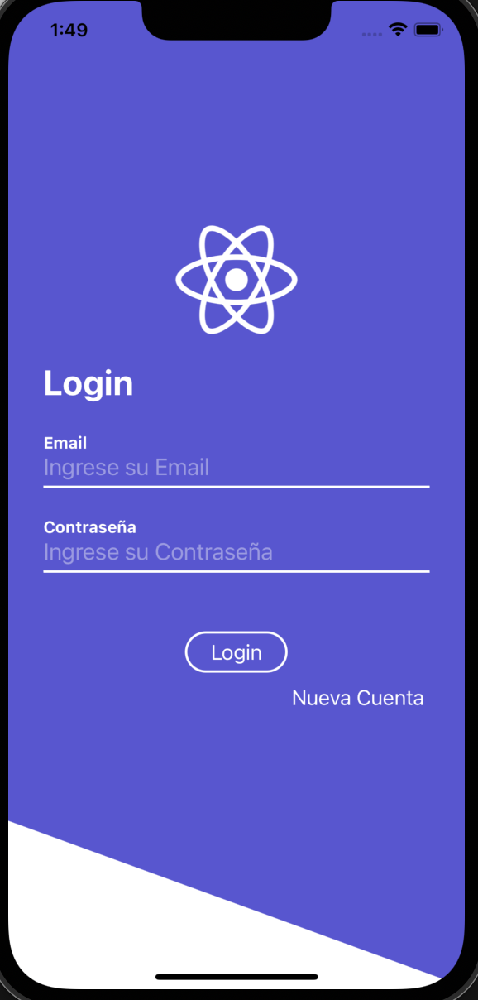
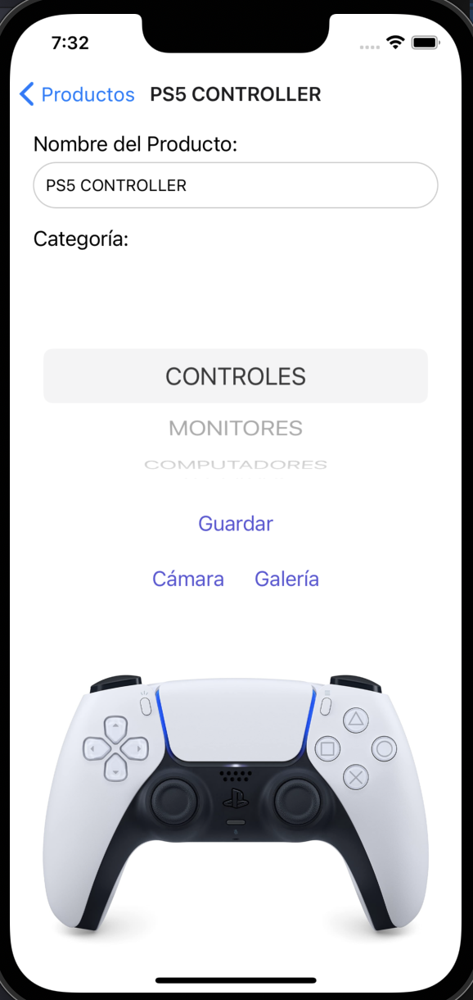

# App Products

This a simple app created with RN that simulates a shop app, a CRUD App.
This implements a backend of my own created with Node, using a Mongo DB.

Before run application, you should first run the backend application.

- To Execute in local:

```
npm install
npx react-native start
npx react-native run-android
npx react-native run-ios

```

<p align="center">
    
    
</p>
